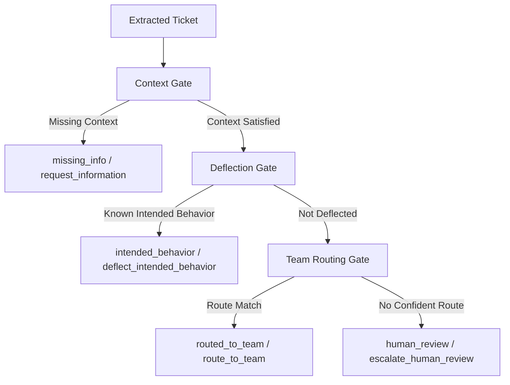

# Data Quality Ticket Triage — Modular Route-Agent Design

Data quality tickets should not need a large custom transition map. Most of the workflow can be expressed through one reusable routing pattern:

```text
extract context
→ decide route outcome
→ request information OR deflect intended behavior OR route to team OR human review
```

The category-specific behavior should live in the rulebook as:

```text
context_requirements
deflection_rules
team_route_rules
```

This keeps the state machine small and makes the process easier to extend to other bug types.

---

## 1. Core Route Outcomes

For data quality, the Route Agent should return one of four outcomes:

| Route Outcome | Meaning | Resulting State | Recommended Action |
|---|---|---|---|
| `request_information` | Required context is missing | `missing_info` | `request_information` |
| `deflect_intended_behavior` | Issue matches known expected behavior | `intended_behavior` | `deflect_intended_behavior` |
| `route_to_team` | Enough context exists and a team route matches | `routed_to_team` | `route_to_team` |
| `escalate_human_review` | Rulebook cannot confidently decide | `human_review` | `escalate_human_review` |

These are reusable across many ticket types, not just data quality.

---

## 2. Generic State Model

Keep states generic. Do not create a new state for every destination team.

### Recommended Shared States

| State | Meaning |
|---|---|
| `new` | Ticket has arrived but has not been processed |
| `extracting_context` | Agent is extracting entities and evidence |
| `route_decision` | Route Agent is evaluating gates and route rules |
| `missing_info` | Ticket is blocked until reporter provides required context |
| `intended_behavior` | Ticket matches documented expected behavior |
| `routed_to_team` | Ticket has enough context and should be routed to a team |
| `waiting_reporter_confirmation` | Fix or explanation was sent; waiting for reporter confirmation |
| `complete` | Work is functionally complete |
| `closed` | Ticket is formally closed |
| `human_review` | Rulebook cannot confidently decide |

### Important Design Choice

Prefer this:

```json
{
  "state": "routed_to_team",
  "route_target": "finance_queue",
  "route_rule_id": "finance_policy_route"
}
```

Do not model every team as a separate state unless that team has a genuinely different workflow:

```json
{
  "state": "routed_finance"
}
```

`finance_queue`, `crc_l3_support`, and `data_quality_team` are route targets, not core workflow states.

---

## 3. Generic Action Types

Use a small reusable action enum:

```text
extract_context
request_information
deflect_intended_behavior
route_to_team
ask_reporter_to_confirm
close_as_resolved
escalate_human_review
```

Specificity belongs in metadata:

```json
{
  "type": "request_information",
  "comment_template": "ask_for_diagnostic_evidence",
  "missing_fields": ["diagnostic_evidence"]
}
```

or:

```json
{
  "type": "route_to_team",
  "route_target": "finance_queue",
  "route_rule_id": "finance_policy_route"
}
```

This avoids action-type explosion such as:

```text
request_source_system
request_diagnostic_evidence
route_finance
route_crc_l3
deflect_sync_lag
```

Those can be represented as templates, route rules, or deflection rule IDs.

---

## 4. Route Agent Algorithm

The Route Agent runs the same gate sequence for every ticket type:

```text
1. Context Gate
   If required context is missing:
   → state = missing_info
   → action = request_information

2. Deflection Gate
   If known intended behavior matches:
   → state = intended_behavior
   → action = deflect_intended_behavior

3. Team Routing Gate
   If a route rule matches:
   → state = routed_to_team
   → action = route_to_team

4. Fallback
   If no route is confident:
   → state = human_review
   → action = escalate_human_review
```

Diagram:



---

## 5. Data Quality Rulebook Module

Data quality-specific logic should be declared as rulebook configuration.

### Context Requirements

```json
{
  "context_requirements": {
    "required_all": [
      "issue_summary",
      "source_system"
    ],
    "required_any": [
      {
        "group": "diagnostic_evidence",
        "fields": [
          "po_numbers",
          "project_codes",
          "document_links",
          "has_screenshot"
        ]
      }
    ]
  }
}
```

Interpretation:

```text
issue_summary is required
source_system is required
at least one diagnostic evidence field is required
```

Diagnostic evidence is satisfied if the ticket has at least one of:

```text
PO number
project ID / S-code
linked report / document
screenshot
```

If a link or screenshot exists, diagnostic evidence is satisfied.

---

## 6. Deflection Rules

Deflection rules explain known intended behavior before routing to a human team.

```json
{
  "deflection_rules": [
    {
      "id": "external_sync_lag",
      "criteria": {
        "keywords": ["sync lag", "batch sync", "sync delay"]
      },
      "result": {
        "state": "intended_behavior",
        "action_type": "deflect_intended_behavior",
        "comment_template": "deflect_sync_lag"
      }
    },
    {
      "id": "view_filter_mismatch",
      "criteria": {
        "keywords": ["filter", "dashboard view", "applied filters"]
      },
      "result": {
        "state": "intended_behavior",
        "action_type": "deflect_intended_behavior",
        "comment_template": "deflect_view_filters"
      }
    },
    {
      "id": "historical_data_logic",
      "criteria": {
        "keywords": ["TLY", "prior year", "historical", "archival"]
      },
      "result": {
        "state": "intended_behavior",
        "action_type": "deflect_intended_behavior",
        "comment_template": "deflect_historical_data_logic"
      }
    }
  ]
}
```

The important abstraction:

```text
state = intended_behavior
action_type = deflect_intended_behavior
deflection_rule_id = external_sync_lag
comment_template = deflect_sync_lag
```

The specific deflection type is metadata, not a separate state or action type.

---

## 7. Team Route Rules

Team routing rules should be independent objects. Each rule has prerequisites, criteria, and a route target.

```json
{
  "route_rules": [
    {
      "id": "finance_policy_route",
      "target": "finance_queue",
      "prerequisites": {
        "context_satisfied": true
      },
      "criteria": {
        "keywords": [
          "accrual",
          "currency",
          "FX rate",
          "financial policy",
          "SAP financial records"
        ]
      },
      "result": {
        "state": "routed_to_team",
        "action_type": "route_to_team",
        "comment_template": "route_finance"
      }
    },
    {
      "id": "crc_l3_route",
      "target": "crc_l3_support",
      "prerequisites": {
        "context_satisfied": true
      },
      "criteria": {
        "keywords": [
          "sync failure",
          "pipeline error",
          "SAP-to-Quickbase integration",
          "software crash",
          "complex logic"
        ]
      },
      "result": {
        "state": "routed_to_team",
        "action_type": "route_to_team",
        "comment_template": "route_crc_l3"
      }
    },
    {
      "id": "data_quality_stewardship_route",
      "target": "data_quality_team",
      "prerequisites": {
        "context_satisfied": true
      },
      "criteria": {
        "keywords": [
          "data entry",
          "merge project",
          "void project",
          "minor configuration",
          "missing record"
        ]
      },
      "result": {
        "state": "routed_to_team",
        "action_type": "route_to_team",
        "comment_template": "route_data_quality"
      }
    }
  ]
}
```

The route target can vary without changing the state machine.

---

## 8. Abstract State Object

The Route Agent should return a compact state object:

```json
{
  "ticket_id": "BUG-123",
  "rulebook": "data_quality_v1",
  "category": "data_quality",
  "phase": "routing",
  "state": "routed_to_team",
  "last_event": "route_matched",

  "entities": {
    "issue_summary": "Quickbase cashflow is missing a SAP PO record",
    "source_system": "SAP",
    "comparison_system": "Quickbase",
    "po_numbers": ["PO-12345"],
    "project_codes": [],
    "document_links": [],
    "has_screenshot": false
  },

  "validation": {
    "context_satisfied": true,
    "missing_fields": [],
    "satisfied_evidence_group": "diagnostic_evidence"
  },

  "routing": {
    "route_decision": "route_to_team",
    "route_target": "finance_queue",
    "route_rule_id": "finance_policy_route",
    "route_reason": "Ticket mentions SAP financial records and PO discrepancy."
  },

  "deflection": {
    "matched": false,
    "deflection_rule_id": null
  },

  "recommended_action": {
    "type": "route_to_team",
    "target": "finance_queue",
    "comment_template": "route_finance",
    "message": "Route to Finance for SAP financial-record discrepancy review."
  },

  "audit": [
    {
      "gate": "context_gate",
      "result": "passed",
      "reason": "Issue summary, source system, and PO number are present."
    },
    {
      "gate": "deflection_gate",
      "result": "not_matched",
      "reason": "No intended-behavior rule matched."
    },
    {
      "gate": "team_routing_gate",
      "result": "matched",
      "rule_id": "finance_policy_route",
      "reason": "SAP financial-record criteria matched."
    }
  ]
}
```

---

## 9. Extension Pattern

To add a new bug type, do not create a new full state machine.

Add a new rulebook module:

```text
rulebooks/new_bug_type.v1.json
```

with:

```json
{
  "category": "new_bug_type",
  "context_requirements": {},
  "deflection_rules": [],
  "route_rules": []
}
```

The same Route Agent can process it.

This is the reusable contract:

```text
category-specific rulebook in
generic route decision out
```

---

## 10. Design Principle

Keep the state machine generic.

Put category-specific detail into:

```text
required fields
evidence groups
deflection rule IDs
route rule IDs
route targets
comment templates
criteria keywords
```

The workflow should remain stable as new bug types are added.
